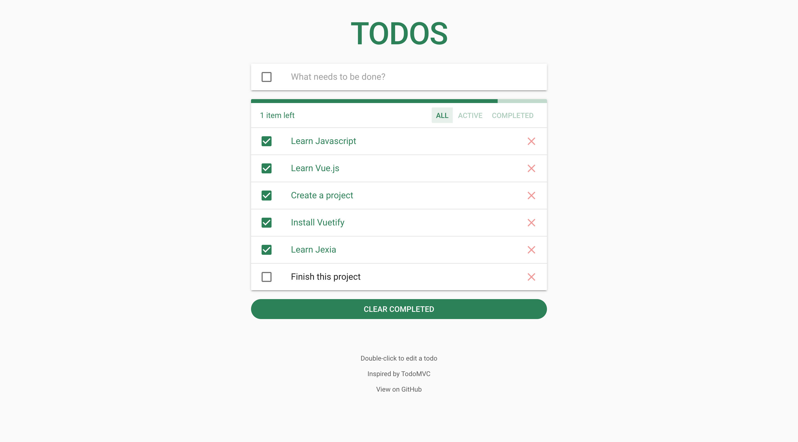
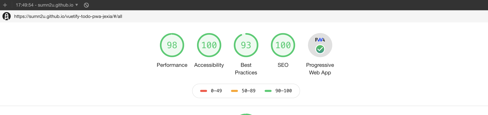

# vuetify-todo-pwa-jexia-jexia
This project is a simple Todo [PWA] (Progressive Web App) inspired by [TodoMVC]. Perfect to learn the basics about [Vue.js], [Vuex] and [Vuetify] technologies and uses [Jexia] to build serverless application.

Note: This project is forked from [vuetify-todo-pwa]

[PWA]: https://developers.google.com/web/progressive-web-apps
[TodoMVC]: http://todomvc.com
[Vue.js]: https://vuejs.org
[Vuex]: https://vuex.vuejs.org
[Vuetify]: https://vuetifyjs.com
[Jexia]: https://www.jexia.com/
[vuetify-todo-pwa]: https://github.com/davidgaroro/vuetify-todo-pwa

<p align="center">
  <a href="https://sumn2u.github.io/vuetify-todo-pwa-jexia" target="_blank" rel="noopener">
    
    Live Demo
  </a>
</p>

<p align="center">
    
</p>

## Features
 - Vue CLI 3 + Webpack + vue-loader for single file Vue components
	-  Hot-reload in development
	-  Lint-on-save with [ESLint (Standard)](https://github.com/standard/eslint-config-standard)
	-  Stylus CSS preprocessor
 - Vue + vue-router + vuex working together
 - Vuetify a-la-carte (reduce project's size  in production)
 - Progressive Web App
	- App manifest
	- Service worker
	- Workbox options - [Cache Google Fonts]
- Jexia to build serverless application
	

[Cache Google Fonts]: https://developers.google.com/web/tools/workbox/guides/common-recipes#google_fonts

## Built With
### Dependencies
| Name| Description | |
|--|--|:--:| 
|[vue]|Progressive JavaScript Framework|🖖
|[vue-cli-3]|️Standard Tooling for Vue.js Development|🛠️
|[vue-router]|Official Router for Vue.js|🚦
|[vuex]|️Centralized State Management for Vue.js|🗃️
|[vuetify]|️Material Component Framework for Vue.js|📚
|[axios]|️Promise based HTTP client for the browser and node.js|🕸️

[vue]: https://vuejs.org
[vue-router]: https://router.vuejs.org
[vue-cli-3]: https://cli.vuejs.org
[vuex]: https://vuex.vuejs.org
[vuetify]: https://vuetifyjs.com
[axios]: https://github.com/axios/axios

### Development Dependencies
| Name| Description | |
|--|--|:--:| 
|[stylus-loader]|CSS preprocessor for webpack|🎨
|[vue/cli-plugin-babel]|Compiler for next generation JavaScript|🐠
|[vue/cli-plugin-eslint]|Pluggable JavaScript linter|✍️
|[vue/cli-plugin-pwa]|JavaScript Library for adding support to PWA|📱

[stylus-loader]: https://github.com/shama/stylus-loader
[vue/cli-plugin-babel]: https://github.com/vuejs/vue-cli/tree/dev/packages/%40vue/cli-plugin-babel
[vue/cli-plugin-eslint]: https://github.com/vuejs/vue-cli/tree/dev/packages/%40vue/cli-plugin-eslint
[vue/cli-plugin-pwa]: https://github.com/vuejs/vue-cli/tree/dev/packages/%40vue/cli-plugin-pwa

## Installation & Setup
### Clone repository
```
git clone https://github.com/sumn2u/vuetify-todo-pwa-jexia.git
cd vuetify-todo-pwa-jexia
```

### Install dependencies
```
npm install
```

### Compiles and hot-reloads for development
```
npm run serve
```

### Compiles and minifies for production
```
npm run build
```

### Lints and fixes files
```
npm run lint
```

## License
[MIT](./LICENSE) &copy; sumn2u
